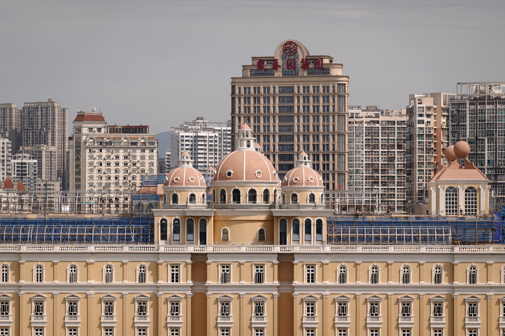
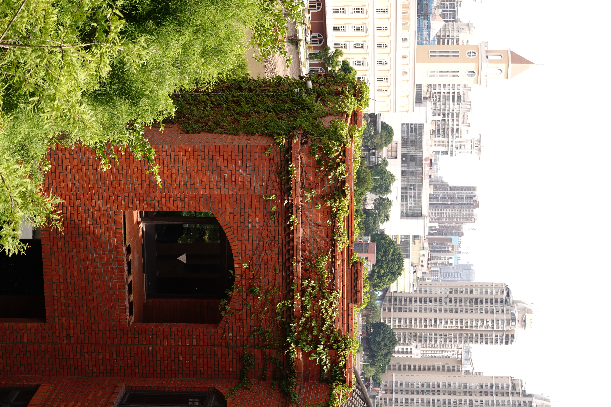
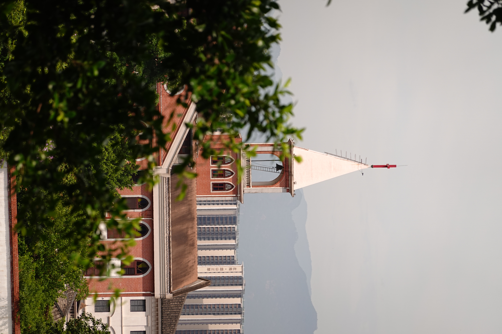
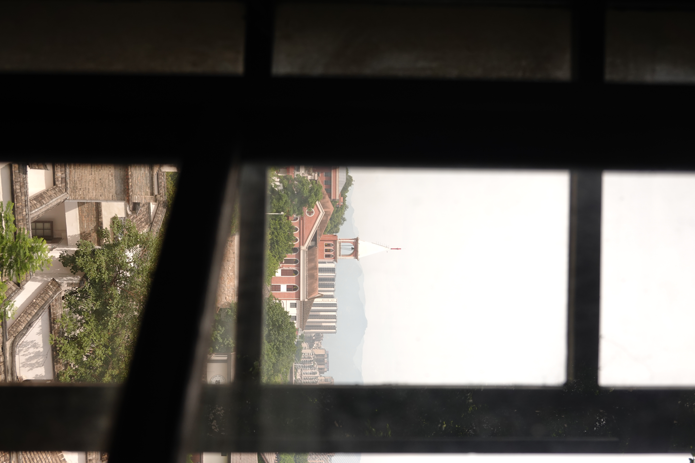
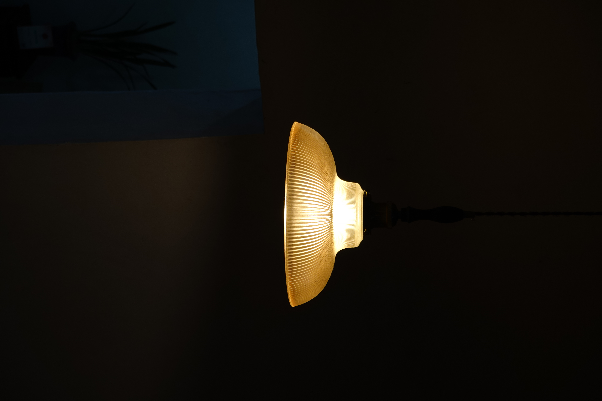
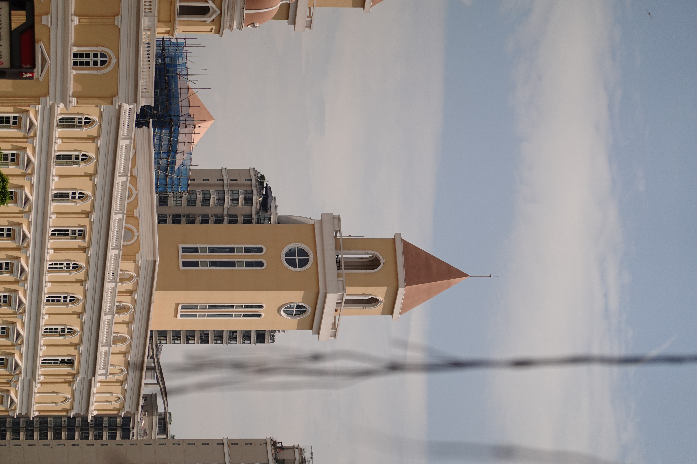
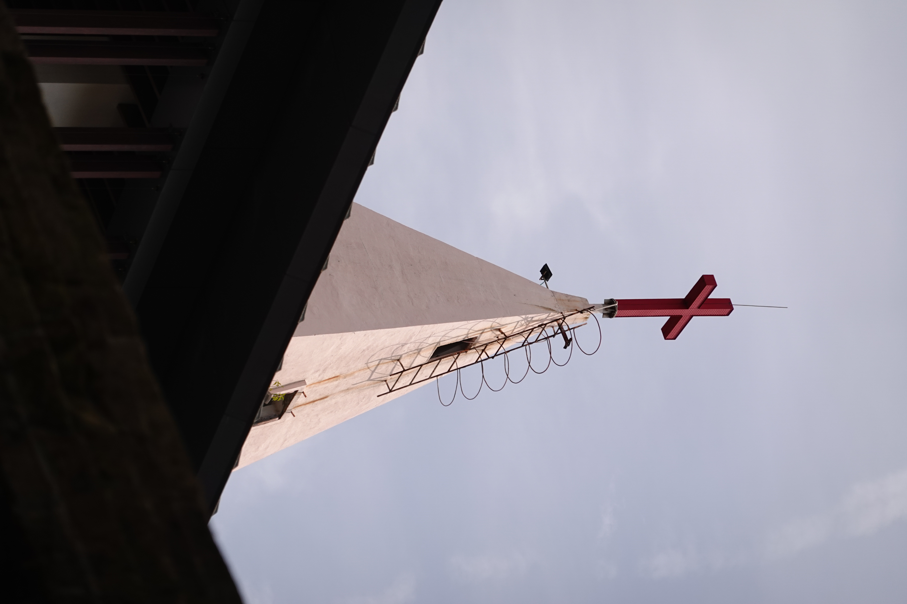

第二次遇见泉州，我不再揣着清单赶路，而是把这座闽南小城当做一间巨大的充电站，任由它的湿热、喧嚷与闲散，来恢复那些被不配得、不满足和不顺心耗掉的大半能量。

午后，在侨乡商品街漫无目的地走，忽然瞥见一家铺子前，店家正将新糊的纸灯笼一只只串起晾干。凑近看，素白的纸面上，墨迹未干的“小满”二字，正静静洇开。那个瞬间，泉州递给我一枚答案——我长久以来的痛苦背面是不肯接受的“未满”。普通人哪得万事周全？满足于当下的拥有，也宽容地拥抱缺憾——这或许便是“小满”的深意。

回程时，我什么也没买，却觉得行囊比来时沉了许多。

